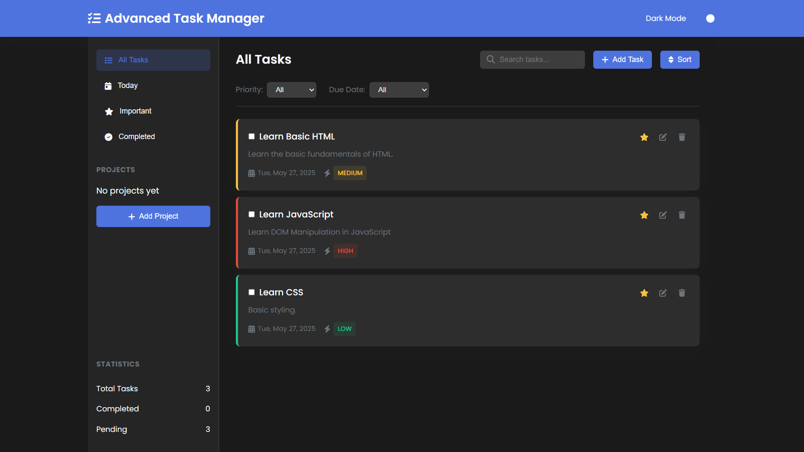
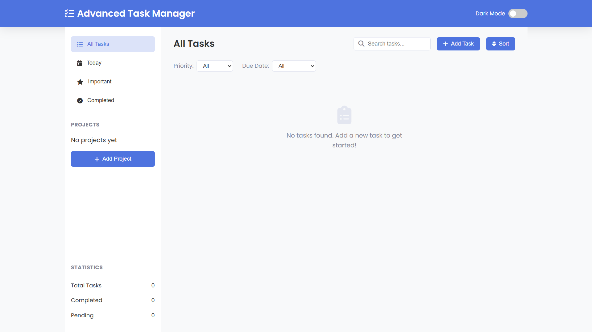
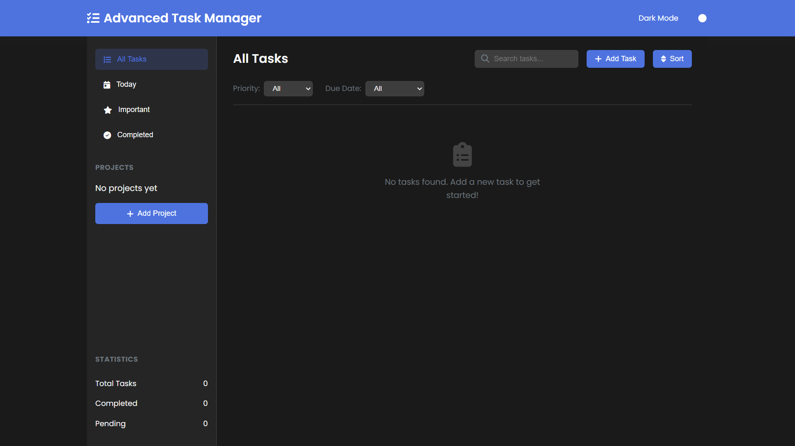
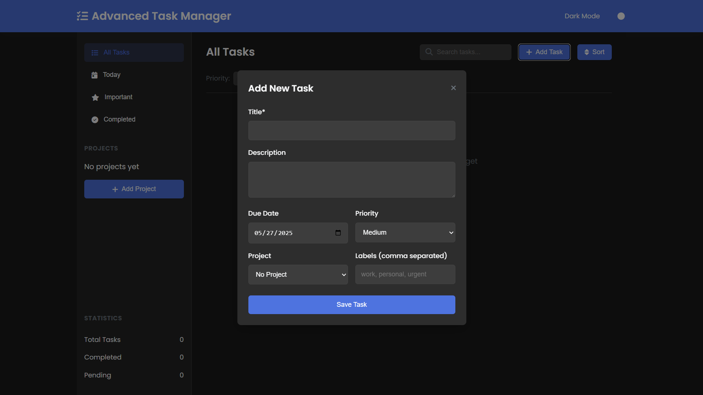

# Advanced Task Manager Using HTML, CSS and JavaScript with Source Code

**Submitted by Remy Andrade on Tuesday, May 27, 2025 - 18:46.**

**Language:** JavaScript

**Welcome to the Advanced Task Manager – your all-in-one solution
for effortless task organization!
**This modern web application combines sleek design with powerful functionality,
elping you stay on top of your to-dos with ease.
Built with HTML, CSS, and JavaScript, it offers a responsive, intuitive interface
hat works seamlessly across all your devices.
Whether you're managing daily chores, work projects, or personal goals,
this tool keeps everything neatly organized and just a click away.

**Take control of your productivity with smart features
designed to simplify your workflow.**
Create tasks, set priorities, organize by projects, and track progress
with visual statistics.
The built-in dark/light mode ensures comfortable viewing anytime,
while powerful filters and search help you find exactly what you need in seconds.
Best of all, your data stays safe between sessions with automatic local storage.
Try it now and experience task management made simple!

### **Key Features:**

✅ **Task Management** – Add, edit, delete, and mark tasks as complete.
✅ **Project Organization** – Group tasks into customizable projects with color-coding.
✅ **Smart Filtering & Sorting** – Filter by priority, due date, and completion status. Sort tasks by due date, priority, or title.
✅ **Dark/Light Mode** – Switch between themes for comfortable viewing.
✅ **Search Functionality** – Quickly find tasks by keywords.
✅ **Statistics Dashboard** – Track completed, pending, and total tasks.
✅ **Responsive Design** – Works on desktop, tablet, and mobile devices.
✅ **Local Storage** – Tasks and projects persist even after closing the browser.

### **Technologies Used:**

*   **HTML5** – Structure and layout of the application.
*   **CSS3** – Styling, animations, and responsive design.
*   **JavaScript (ES6+)** – Dynamic functionality and interactivity.
*   **Font Awesome** – Icons for a better UI experience.
*   **Google Fonts (Poppins)** – Modern and clean typography.
*   **LocalStorage** – Persistent data storage.

### **How to Use:**

#### Adding a Task
1.  Click the **"Add Task"** button.
2.  Fill in the task details (title, description, due date, priority, project, and labels).
3.  Click **"Save Task"** to add it to your list.

#### Managing Tasks
*   ✔️ **Mark as Complete** – Check the checkbox to mark a task as done.
*   ⭐ **Mark as Important** – Click the star icon to prioritize a task.
*   ✏️ **Edit Task** – Click the edit button to modify task details.
*   🗑️ **Delete Task** – Click the trash icon to remove a task.

#### Organizing with Projects
*   Click **"Add Project"** to create a new project.
*   Assign tasks to projects for better organization.

#### Filtering & Sorting
*   Use the filter dropdowns (priority, due date) to refine your task list.
*   Click **"Sort"** to rearrange tasks by due date, priority, or title.

#### Searching Tasks
*   Type in the search bar to find specific tasks by title or description.

#### Switching Themes
*   Toggle the **Dark Mode** switch in the header to change the theme.

# Sample Screenshots of the Project

### **Landing Page**

### **Dark Mode**

### **Add Task Modal**

### **Sample Tasks**

### **How to Run?**

1.  **Download** the provided source code **zip** file.
2.  **Extract** the downloaded **zip** file.
3.  **Open** the **html** file and you are now ready to go!

### **Conclusion:**

**In conclusion, the Advanced Task Manager delivers a perfect blend
of simplicity and functionality, offering a powerful yet intuitive way
to organize your tasks and boost productivity.
**With its clean design, smart features like project organization,
priority sorting, and theme customization,
along with seamless cross-device accessibility,
this application provides everything you need to stay on top
of your responsibilities—all while keeping your data secure
and instantly accessible.
Give it a try and transform the way you manage your daily tasks! 🚀

That's it!
I hope this **"Advanced Task Manager Using HTML, CSS and JavaScript"**
will assist you on your programming journey,
providing value to your current and upcoming projects.

For additional tutorials and free source codes, explore our website.

### **Enjoy Coding :>>**

Original article:
[Advanced Task Manager Using HTML, CSS and JavaScript with Source Code](https://www.sourcecodester.com/javascript/18119/advanced-task-manager-using-html-css-and-javascript-source-code.html)
